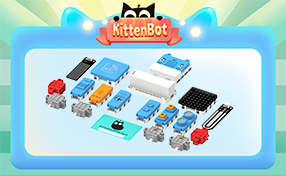

# powerbrick

Extension for Kittenbot powerbrick module series


## Feature

Microbit is just a bare board. If only a single LED light is on, it won't last long to attract young people to continue learning programming. In practice we found that the wiring process is still a high threshold for most primary and middle school students. It is not friendly to class. We hope that students will put more energy into the logic of programming, instead of wiring. We hope that they can quickly use their common objects in the home to quickly realize their ideas, express their logic ideas in real form, and skillfully use electronic modules to solve problems in life. 

Powerbrick is composition by Armoubit and a series of electrionic and actuator modules. The Armoubit act as module hub to microbit, which caters to the current deucational needs. 

With Madecode as the programming platform, users can learn the most common and effective programming methods without staying in a specific programming language or software of a hardware manufacturer. Armourbit expansion box with servo drive, motor drive, buzzer.


----------

For more infomation please visit [Learn Powerbrick](http://learn.kittenbot.cn/zh_CN/latest/powerbrick/index.html)

## License

MIT

## Supported targets

* for PXT/microbit
* for PXT/meowbit
(The metadata above is needed for package search.)

```package
powerbrick=github:Kittenbot/pxt-powerbrick
```